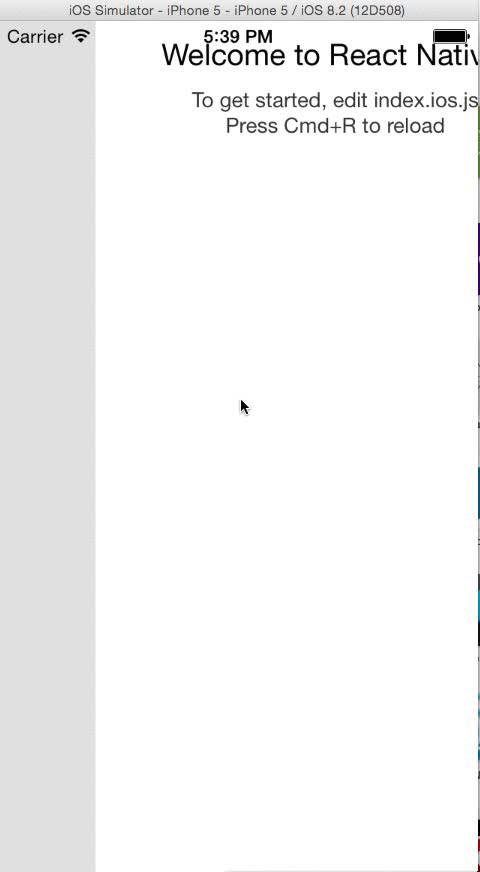

# RNSideMenu

# Preview
<p align="center">
   
</p>

# Examples

Clone this repo and take a look of the **index.ios.js**

# Usage

```javascript
var SideMenu = require('sidemenu');

global.sideMenu = 
      <SideMenu
      frontView={FrontView}
      sideView={<SideView />}
      />;

var App = React.createClass({
  render: function () {
    return (
      <View style={styles.container} >
        {sideMenu}
      </View>
    );
  }
})
```

Then at any place of you code, if you wanna toggle **SideView** manually, call sideMenu.props.toggleSideView()

# Have questions?
Create an issue at [main repo](https://github.com/khanghoang/RNSideMenu)

# About me
Follow me at [@khanght](https://twitter.com/khanght)
